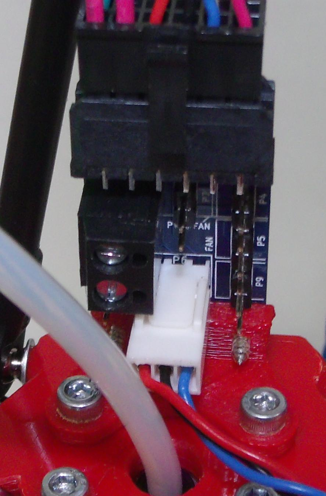
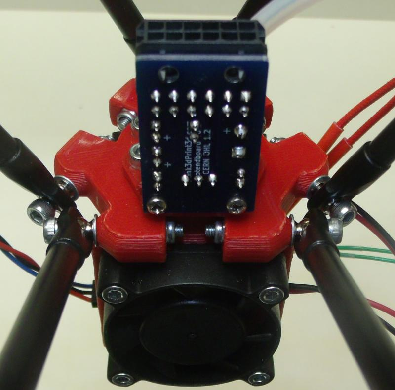

Kossel Hotend PCB

This is a small PCB designed to fit on the Think3dPrint3d version of the Kossel Delta 3d printer although it will fit similar delta printers as well.

  

  

For more information on our Kossel Kit visit
https://www.think3dprint3d.com/Kossel-Mini-3dPrinter-Kit

Licensing information in the LICENSE file.

Distributed as-is; no warranty is given.
